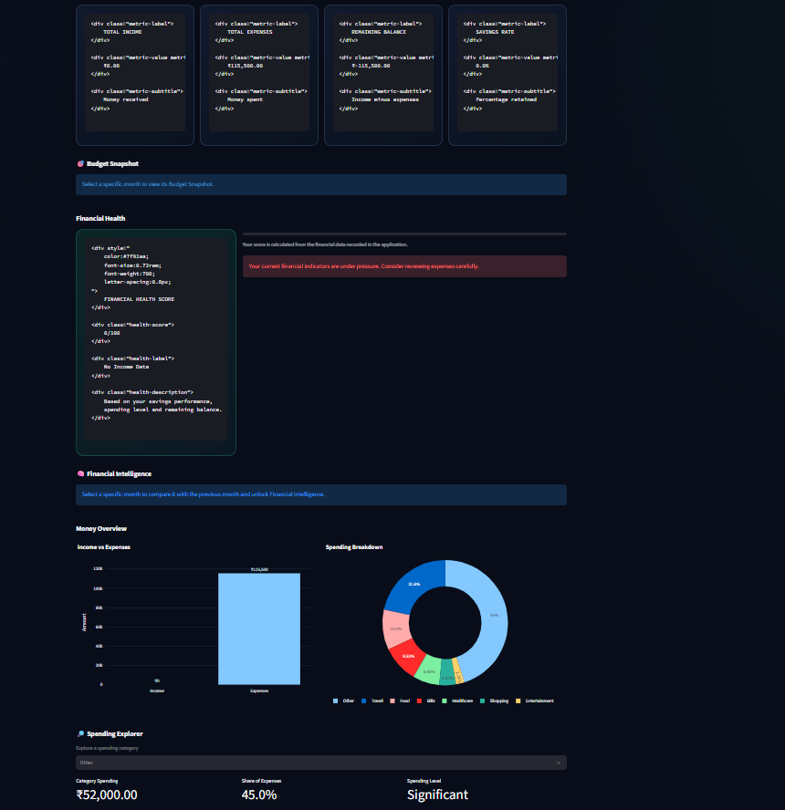
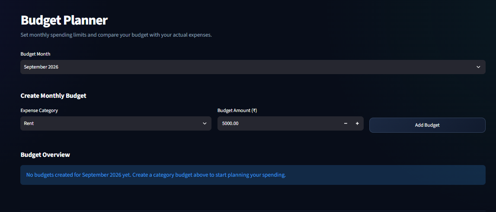
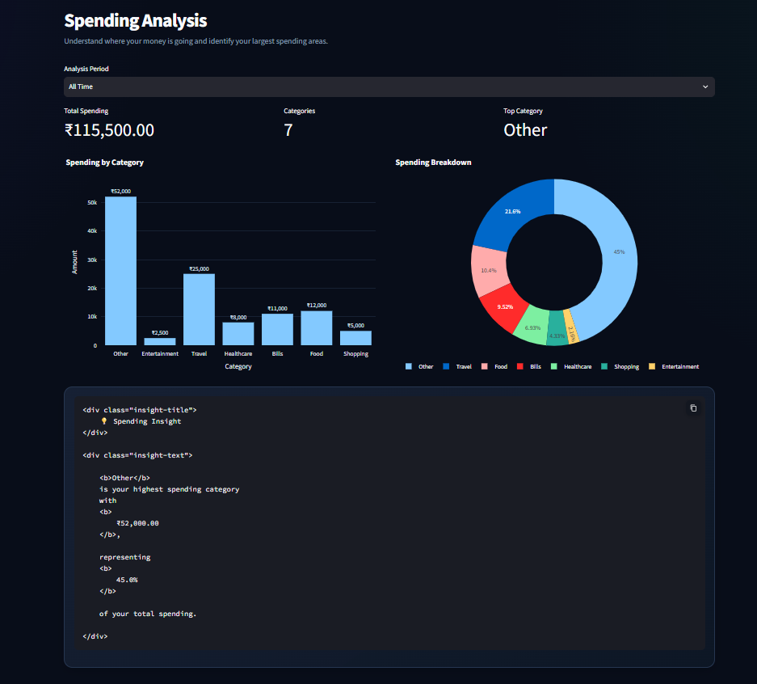
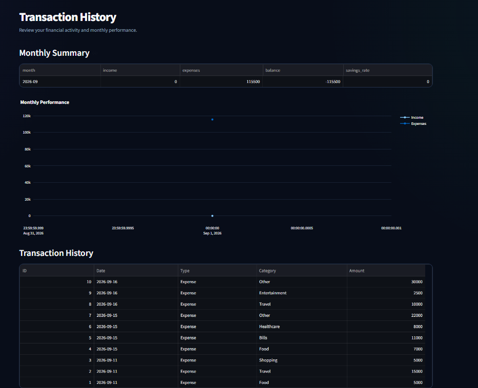
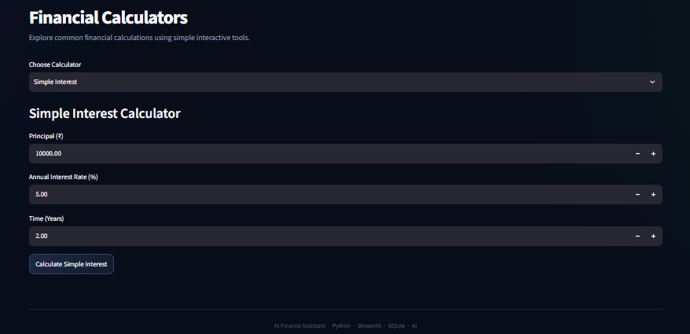
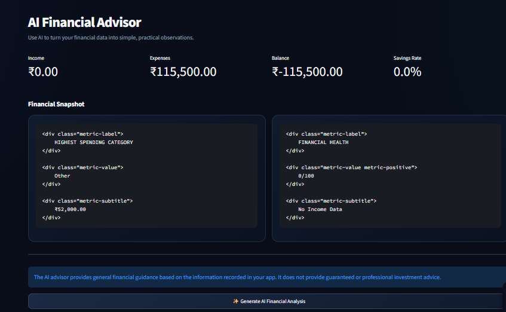

# 💼 AI Finance Assistant

> A modern personal finance application that combines financial tracking, spending analysis, budgeting, financial health monitoring, financial calculators, and AI-powered financial insights.


---

## 📌 Overview

**AI Finance Assistant** is a Python-based personal finance application designed to help users understand and manage their finances through an interactive and modern dashboard.

The application allows users to:

- Track income and expenses
- Analyze spending patterns
- Manage monthly budgets
- Monitor financial health
- View financial trends
- Perform common financial calculations
- Generate financial insights
- Access an AI-powered financial advisor

The project was developed as a hands-on learning project while building practical skills in **Python, data analytics, application development, databases, and AI/ML fundamentals**.

---

# 📸 Application Screenshots

## 📊 Financial Dashboard

The dashboard provides a centralized overview of income, expenses, balance, savings, financial health, spending patterns, and budget utilization.



---

## 🎯 Budget Planner

The Budget Planner allows users to define monthly category budgets and compare planned spending with actual expenses.



---

## 📈 Spending Analysis

The Spending Analysis section helps users understand where their money is being spent through category-level analysis and visualizations.



---

## 📜 Transaction History

Users can review their income and expense history and analyze monthly financial performance.



---

## 🧮 Financial Calculators

The application provides commonly used financial calculators for simple interest, compound interest, SIP, and EMI calculations.



---

## 🤖 AI Financial Advisor

The AI Financial Advisor uses a structured financial summary to generate AI-powered financial insights.



---

# ✨ Key Features

### 📊 Interactive Dashboard

Provides an overview of:

- Total income
- Total expenses
- Current balance
- Savings rate
- Expense ratio
- Financial health
- Budget utilization
- Spending breakdown
- Financial trends
- Recent transactions

### 💰 Income & Expense Tracking

Users can record:

- Income source
- Expense category
- Amount
- Transaction date

Data is stored locally using SQLite.

### 📈 Spending Analysis

Analyze expenses by category and identify:

- Total spending
- Number of categories
- Highest spending category
- Category-wise spending
- Spending percentage

### 🎯 Budget Planner

Users can create monthly budgets for different spending categories.

The application compares:

**Budget → Actual Spending → Remaining Budget**

and identifies whether a category is:

- Within Budget
- Almost Reached
- Over Budget

### ❤️ Financial Health

The application calculates a financial health score using financial indicators such as income, expenses, savings, and spending patterns.

### 💡 Financial Insights

The application compares financial activity and generates insights based on:

- Income trends
- Expense trends
- Savings trends
- Spending behavior
- Budget utilization

### 🤖 AI Financial Advisor

The AI Advisor converts financial information into a structured prompt and uses an AI model to generate financial guidance.

The application also includes error handling for situations where an external AI service is unavailable.

### 🧮 Financial Calculators

The application includes:

- Simple Interest Calculator
- Compound Interest Calculator
- SIP Calculator
- EMI Calculator

---

# 🧠 AI & Data Analytics

The project combines traditional financial calculations with AI-oriented functionality.

### Financial Data Flow

```text
User Financial Data
        ↓
SQLite Database
        ↓
Python Processing
        ↓
Pandas Analysis
        ↓
Financial Metrics
        ↓
Charts & Insights
        ↓
AI Financial Advisor